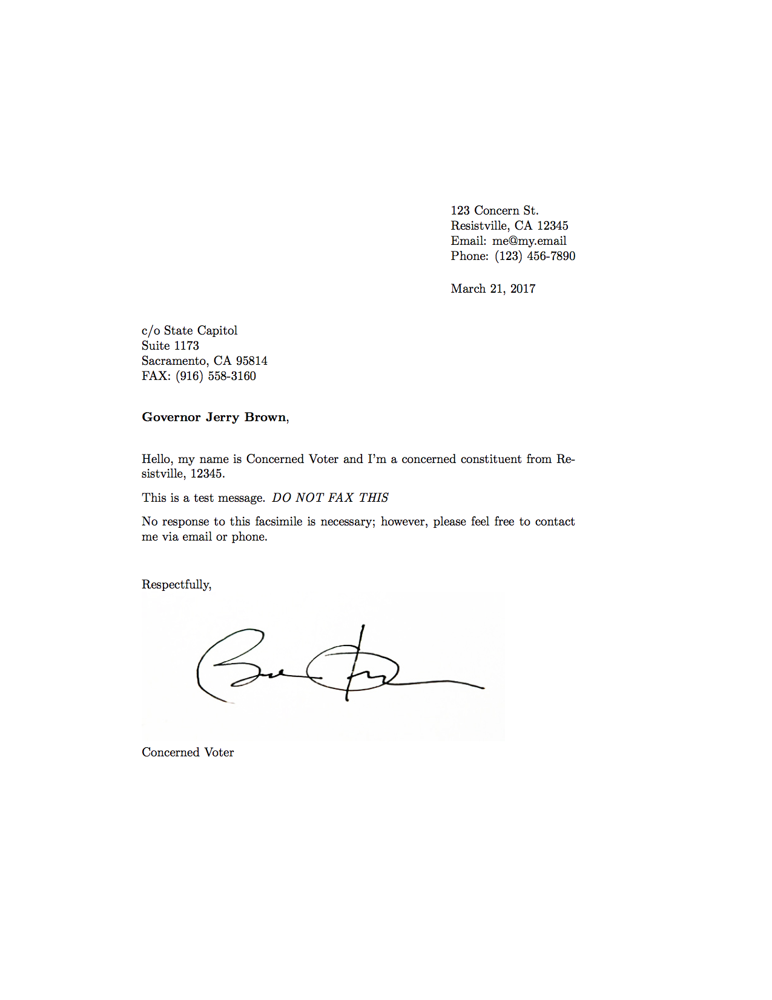

# alternativefax

* Conway: "You're saying it's a falsehood and Sean Spicer, our press secretary, gave alternative facts to that."
* Todd: "Alternative facts are not facts. They are falsehoods."

My ISP has a free fax service so I wrote this simple program to autogenerate PDFs to my representatives, senators, committee members, etc. I'm sharing it here in the hopes that it might be useful to others. Pull requests are welcomed.

To install alternativefax:

1. Download [the latest version of alternativefax](https://github.com/massie/alternativefax/archive/master.zip) (or use `git clone`)
2. Make sure you have the `latex` Python module installed, e.g. `pip install latex`
3. Create a signature image and save it to e.g. `signature.png`.
4. Copy the `sender.csv.example` file to `sender.csv` and update the fields. Make sure that you the path to your signature file matches with step 3 above.
5. Update the `addressees.csv` file to contain the people that you want to generate faxes for.

*WARNING:* be careful not to check in your `signature.png` or `sender.csv` file into git since it contains personal information (the repo `.gitignore` is setup to ignore them). You can use e.g. `git grep <name>` to see if your information leaked into git.

To use alternativefax:

```bash
$ cat > message.txt
This is a test message. \textit{DO NOT FAX THIS}
^D
$ ./generate.py message.txt
$ ls *.pdf
message.txt.committee_on_oversight_and_government_reform.pdf
message.txt.committee_on_ways_and_means.pdf
message.txt.congressman_mark_desaulnier.pdf
message.txt.governor_jerry_brown.pdf
message.txt.senator_dianne_feinstein.pdf
message.txt.senator_kamala_harris.pdf
```

Here's an example of one of the generated faxes.



In order to have your FAX added to the daily contact totals, keep your messages short and direct and make sure the FAX contains your address and zip code, especially if you are a constituent. The provided `fax.latex` does just that, if you mark the `constituent` field in `addressees.csv` as `True` (see `fax.latex` for details).
